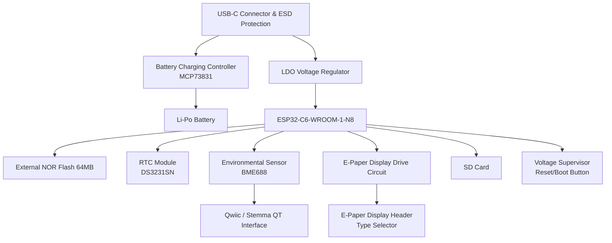

# 1. Diagrama Bloc
Diagrama de mai jos arata fluxul de alimentare si conectivitatile principale intre componentele proiectului:

# 2. Functionalitate Hardware
===========================

### 2.1 Module, Componente si Senzori

**ESP32-C6-WROOM-1-N8**

- **Rol**: Microcontroler principal, coordoneaza comunicarile (SPI, I2C, UART etc.), citirea senzorilor si controlul perifericelor.

**USB-C Connector & ESD Protection**

- **Rol**: Permite alimentarea prin USB-C si asigura protectie la descarcari electrostatice.

**Battery Charging Controller (MCP73831)**

- **Rol**: Incarca bateria Li-Po si gestioneaza curentul de incarcare.

**Li-Po Battery**

- **Rol**: Sursa de alimentare secundara, permite functionarea sistemului fara USB.

**LDO Voltage Regulator**

- **Rol**: Stabilizeaza tensiunea de 3.3V pentru ESP32-C6 si alte componente.

**External NOR Flash 64MB**

- **Rol**: Memorie suplimentara pentru stocarea datelor si a firmware-ului.

**RTC Module (DS3231SN)**

- **Rol**: Furnizeaza ceas de timp real (Real-Time Clock) cu mare acuratete.
- **Interfata**: I2C, cu suport pentru alarme si detectie a pierderii de tensiune (baterie backup).

**Environmental Sensor (BME688)**

- **Rol**: Masoara temperatura, umiditatea, presiunea si calitatea aerului (VOC).
- **Interfata**: I2C, consum redus in modul standby, integreaza un senzor de gaze.
- **Integrare**: Foloseste Qwiic / Stemma QT pentru conectare rapida.

**E-Paper Display Drive Circuit si Header**

- **Rol**: Genereaza semnalele necesare pentru controlul unui ecran E-Paper si permite selectarea tipului de display.
- **Interfata**: SPI, cu linii de control dedicate (Busy, Reset, DC, CS).

**SD Card**

- **Rol**: Stocare locala de date, fisiere de configurare sau inregistrari pe termen lung.
- **Interfata**: SPI, cu linii separate de chip select.

**Voltage Supervisor + Reset/Boot Button**

- **Rol**: Monitorizeaza tensiunea de alimentare si gestioneaza semnalele de reset si boot pentru ESP32-C6.

### 2.2 Specificatii de Comunicare

- **I2C**: Folosit pentru BME688 si DS3231SN.
- **SPI**: Folosit pentru NOR Flash, E-Paper Display si SD Card.
- **UART**: Disponibil pentru debug sau alte module optionale.
- **Wi-Fi si Bluetooth LE**: Furnizate de ESP32-C6.

### 2.3 Procesare si Calcule de Consum de Energie

- **ESP32-C6**:
  - Consum in mod activ: ~80-240 mA (in functie de sarcina Wi-Fi/BT).
  - Consum in mod sleep: <1 mA (mod deep sleep).

- **BME688**:
  - Consum tipic: ~2.1 uA in sleep, pana la ~3.1 mA in mod activ.

- **NOR Flash**:
  - Consum in citire/scriere: 5-15 mA, in standby: <10 uA.

- **DS3231SN**:
  - Consum: ~150 uA cu backup la baterie.

- **LDO**:
  - Eficienta depinde de diferenta de tensiune (Vin - 3.3V) si curentul total.

In functie de scenariul de utilizare, modul sleep al ESP32-C6 si senzorii in standby reduc semnificativ consumul. Bateria Li-Po poate sustine sistemul pentru ore sau chiar zile, in functie de capacitate si de cat de des se activeaza comunicarile Wi-Fi/BT.

# 3. Pini ESP32-C6 si Motivatii
=============================

In tabelul de mai jos sunt prezentate pinii principali ai ESP32-C6 si rolul lor in proiect:

| Pin ESP32-C6 | Componenta / Rol                        | Motivatie                            |
|--------------|-----------------------------------------|--------------------------------------|
| IO14 (SDA)   | I2C SDA catre BME688 si DS3231SN        | Linia de date pentru I2C            |
| IO15 (SCL)   | I2C SCL catre BME688 si DS3231SN        | Semnal de clock I2C                 |
| IO6 (MOSI)   | SPI MOSI catre NOR Flash, E-Paper, SD Card | Transfer date catre periferice SPI   |
| IO7 (MISO)   | SPI MISO din NOR Flash, E-Paper, SD Card  | Primire date de la periferice SPI    |
| IO8 (SCK)    | SPI Clock                               | Semnal de clock SPI                 |
| IO9 (CS1)    | Chip Select NOR Flash                   | Control dedicat pentru NOR Flash    |
| IO10 (CS2)   | Chip Select E-Paper Display             | Control dedicat pentru Display      |
| IO11 (CS3)   | Chip Select SD Card                     | Control dedicat pentru SD Card      |
| IO16, IO17   | UART RX, TX (debug)                     | Debug serial si programare          |
| IO21         | Reset/Boot control                      | Butoane de reset si boot            |

# 4. Alte Informatii Relevante
=============================

### 4.1 Design Log si Randari PCB

**Randari PCB**:

- Exista randari 3D ale PCB-ului care arata pozitionarea componentelor majore: conectorul USB-C, ESP32-C6, senzorii si conectorii.
- Carcasa este proiectata in Fusion 360.

### 4.2 Asezarea Componentelor in Carcasa

- Bateria Li-Po este plasata in jurul PCB-ului pentru a economisi spatiu.
- Conectorii Qwiic / Stemma QT sunt pozitionati in marginea placii pentru a permite atasarea rapida a altor senzori.
- Microcontrolerul ESP36 a fost plasat la marginea PCB-ului pentru a reduce pe cat posibil interferentele la antena. Din acelasi motiv a fost taiat si planul de masa si placa PCB in jurul antenei.