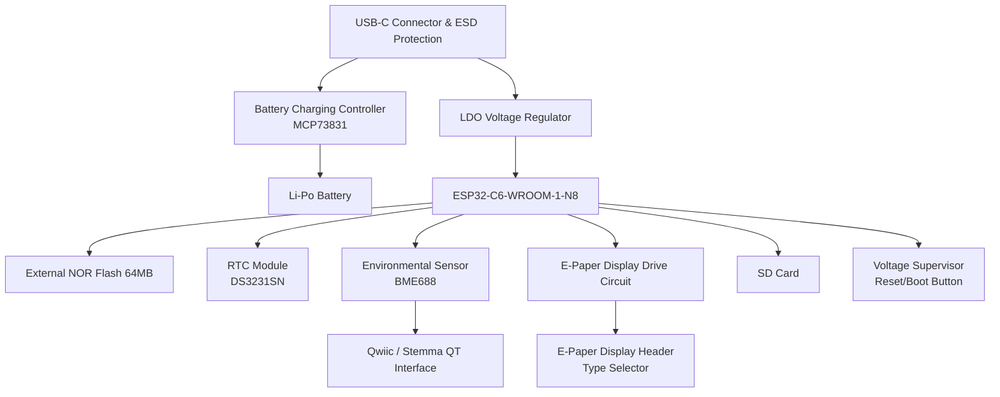

1. Diagrama Bloc
Diagrama de mai jos arata fluxul de alimentare si conectivitatile principale intre componentele proiectului:

```mermaid
flowchart TD
    %% Blocul de alimentare
    A[USB-C Connector & ESD Protection] 
    B[Li-Po Battery]
    C[Battery Charging Controller<br>MCP73831]
    D[LDO Voltage Regulator]

    %% Blocul de procesare si memorie
    E[ESP32-C6-WROOM-1-N8]
    F[External NOR Flash 64MB]
    G[RTC Module<br>DS3231SN]
    
    %% Blocul de senzori si interfete
    H[Environmental Sensor<br>BME688]
    I[Qwiic / Stemma QT Interface]
    
    %% Blocul de afisare
    J[E-Paper Display Drive Circuit]
    K[E-Paper Display Header<br>Type Selector]
    
    %% Blocul de stocare si management
    L[SD Card]
    M[Voltage Supervisor<br>Reset/Boot Button]

    %% Conexiuni Power Supply
    A --> D
    A --> C
    C --> B
    D --> E

    %% Conexiuni pe placa de dezvoltare
    E --> F
    E --> G
    E --> H
    H --> I

    E --> J
    J --> K

    E --> L
    E --> M

```